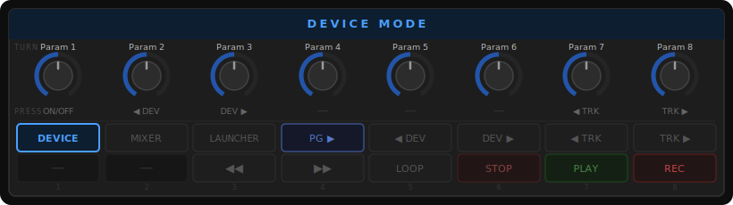
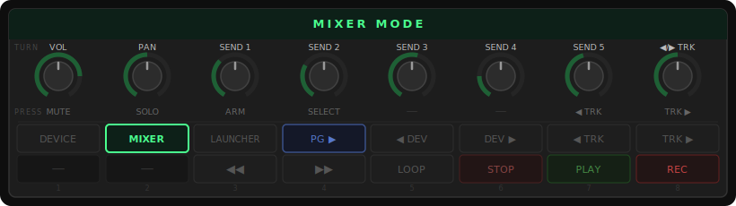
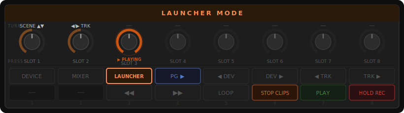

# X-Touch Mini Bitwig Controller

[](LICENSE)

A Bitwig Studio controller script for the Behringer X-Touch Mini, providing three modes: device remote control, mixer, and clip launcher.

## Features

- **DEVICE mode** — control up to 8 remote control parameters of the selected device
- **MIXER mode** — control volume, pan, and up to 6 sends on the selected track
- **LAUNCHER mode** — launch clip slots and scroll scenes on the selected track
- Ring LED feedback reflects parameter values and clip playback state
- Configurable MIDI mappings and encoder behaviour

## Requirements

- Bitwig Studio 6.0 or later
- Behringer X-Touch Mini

## Installation

1. Copy the `XTouchMini/` folder to your Bitwig controller scripts directory:

   **macOS:** `~/Documents/Bitwig Studio/Controller Scripts/`

   ```sh
   rsync -a --delete XTouchMini/ ~/Documents/Bitwig\ Studio/Controller\ Scripts/XTouchMini/
   ```

2. In Bitwig: **Settings → Controllers → Add Controller**
3. Select **Behringer → X-Touch Mini** and assign the X-TOUCH MINI MIDI input and output ports

## Usage

### Layout

```
( 1 ) ( 2 ) ( 3 ) ( 4 ) ( 5 ) ( 6 ) ( 7 ) ( 8 )   ← encoders (knobs + press)
[    ] [    ] [    ] [    ] [    ] [    ] [    ] [    ]  ← top row buttons 1–8
[    ] [    ] [    ] [    ] [    ] [    ] [    ] [    ]  ← bottom row buttons 1–8
```

Button assignments:

```
( 1 ) ( 2 ) ( 3 ) ( 4 ) ( 5 ) ( 6 ) ( 7 ) ( 8 )   ← encoders
[DEV ] [MIX ] [LCH ] [PG> ] [<DEV] [DEV>] [<TRK] [TRK>]  ← top row
[ -- ] [ -- ] [REW ] [FFW ] [LOOP] [STOP] [PLAY] [ REC]   ← bottom row
```

### DEVICE Mode



Encoder turns control the 8 knobs in Bitwig's **Device panel → Remote Controls** section for the selected device.

| Control | Action |
|---------|--------|
| Encoder 1–8 turn | Remote control parameters 1–8 |
| Encoder 1 press | Toggle device on/off |
| Encoder 2 press | Previous device |
| Encoder 3 press | Next device |
| Encoder 7 press | Previous track |
| Encoder 8 press | Next track |
| Top row button 4 | Next remote control page |

### MIXER Mode



| Control | Action |
|---------|--------|
| Encoder 1 turn | Volume |
| Encoder 2 turn | Pan |
| Encoders 3–7 turn | Sends 1–5 (use send bank buttons to access send 6) |
| Encoder 8 turn | Previous/next track |
| Encoder 1 press | Mute |
| Encoder 2 press | Solo |
| Encoder 3 press | Arm |
| Encoder 4 press | Select track in mixer |
| Encoder 7 press | Previous track |
| Encoder 8 press | Next track |

### LAUNCHER Mode



| Control | Action |
|---------|--------|
| Encoder 1–8 press | Launch clip slot 1–8 on selected track |
| Hold record + encoder 1–8 press | Record into clip slot 1–8 on selected track |
| Encoder 1 turn | Scroll scene bank up/down |
| Encoder 2 turn | Previous/next track |

Ring LEDs reflect clip state: off = empty, dim = stopped, medium = playing, bright = recording, medium-bright = queued.

> **Recording a clip:** hold the record button (bottom row, button 8) then press an encoder. The record button LED lights while held to confirm record mode. Releasing the record button exits record mode.

### Navigation Buttons (top row, buttons 5–8 — all modes)

| Button | Note | Action |
|--------|------|--------|
| 5 | 12 | Previous device |
| 6 | 13 | Next device |
| 7 | 14 | Previous track |
| 8 | 15 | Next track |

### Transport Buttons (bottom row, buttons 3–8 — all modes)

| Button | Note | Action |
|--------|------|--------|
| 3 | 18 | Rewind |
| 4 | 19 | Fast forward |
| 5 | 20 | Toggle loop |
| 6 | 21 | Stop transport (or stop all clips on selected track in LAUNCHER mode) |
| 7 | 22 | Play |
| 8 | 23 | Toggle arranger record (or hold to record a clip slot in LAUNCHER mode) |

## Customisation

Edit `XTouchMini/config.js` to change any of the following:

- **`DEBUG` / `DEBUG_MIDI`** — enable logging to Bitwig's controller console
- **`MIDI_CHANNEL` / `MIDI_OUTPUT_CHANNEL`** — MIDI channel (0-based)
- **`ENCODER_MODE`** — `ABSOLUTE`, `RELATIVE_TWO_COMP`, `RELATIVE_SIGN_BIT`, or `RELATIVE_BINARY_OFFSET`
- **`ENCODER_INVERT_DIRECTION`** — flip encoder turn direction
- **`MAP_MAIN_FADER_TO_MOD_WHEEL`** — route the main fader to mod wheel CC
- **Button note/CC assignments** — remap any button by changing the `_NOTE` or `_CC` constants; set CC values to `-1` to disable

## Troubleshooting

**No response from the controller**
- Verify the correct MIDI ports are assigned in Bitwig: Settings → Controllers → the script entry
- Try reloading the script: Settings → Controllers → click the script entry → Reload

**LEDs don't light up**
- Reload the script as above — LEDs are initialised on load
- Confirm the MIDI output port is assigned (not just input)

**Script not found in Bitwig's controller list**
- Make sure the folder was copied as `XTouchMini/` (not a subfolder of it) into the Controller Scripts directory
- Restart Bitwig after copying

## Development

After editing any file, sync to Bitwig and reload:

```sh
rsync -a --delete XTouchMini/ ~/Documents/Bitwig\ Studio/Controller\ Scripts/XTouchMini/
```

Then in Bitwig: **Settings → Controllers → click the script entry → Reload**.

### File Structure

```
XTouchMini/
  XTouchMini.control.js   — Entry point (loadAPI, load() calls, init/flush/exit)
  config.js               — All user-facing constants
  state.js                — Runtime state variables
  helpers.js              — Utility functions
  led.js                  — LED feedback
  handlers.js             — Button and encoder action handlers
  midi.js                 — MIDI routing (onMidi)
  observers.js            — Bitwig API observer setup
```

All files share a single global scope via Bitwig's `load()` mechanism — there is no module system.
